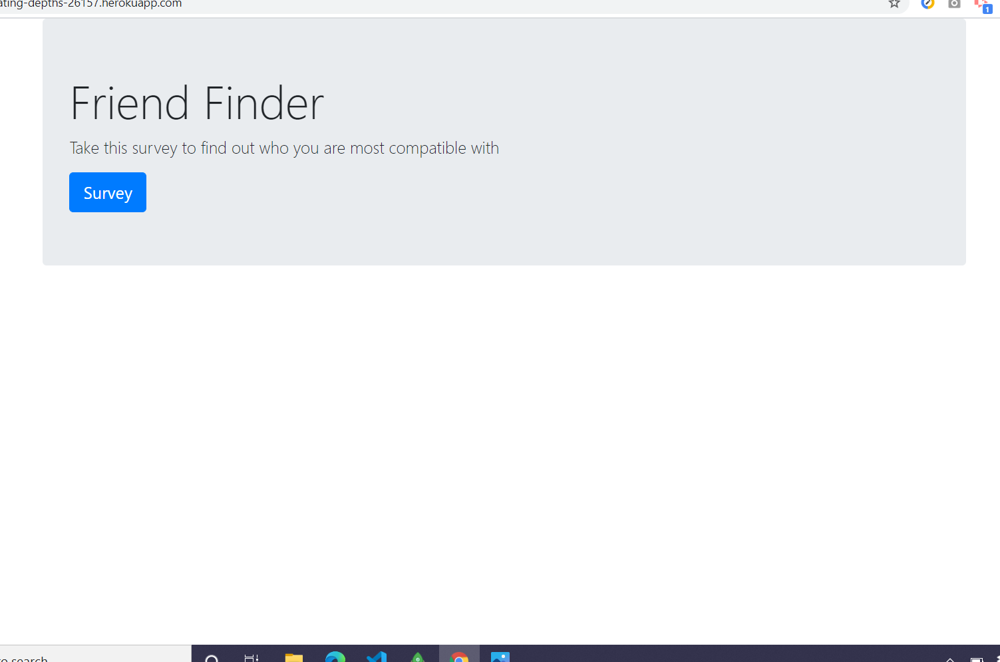
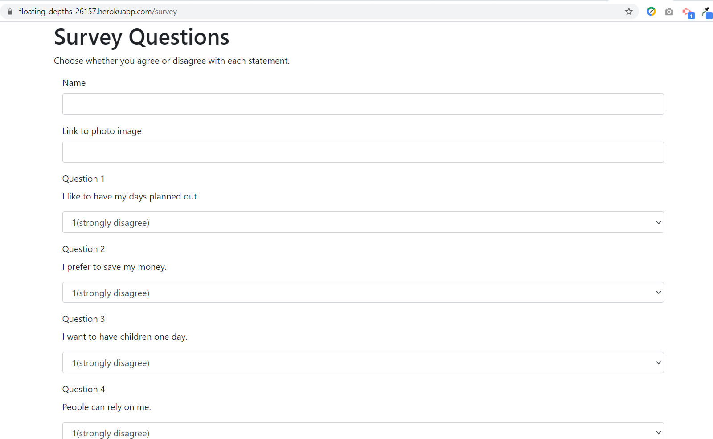

# friendFinder

FriendFinder is a web application designed to help you find a new friend. Take the survey and the app will match you to a person with similar survey answers.

## To Start This App
Npm packages will be necessary to run My Bookshelf. Open your terminal and install:
* NPM
* Express

## To Use This App
### Home Page

### Survey Page

## Deploy
Deploy to Heroku. https://floating-depths-26157.herokuapp.com/

## Built With:
* Javascript
* jQuery
* Node
* Heroku
* NPM
* Git
* GitHub

### Code written by: Jennifer Moundanos
